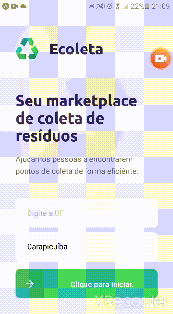

<h1 align="center">
 
  
 
 
Ecoleta
</h1>

Application for selective collection to find collection points throughout your region.

  

  
  

## Features

This app features all the latest tools and practices in mobile development!

- ⚛️ **React Js** 	- A JavaScript library for building user interfaces
- ⚛️ **React Native** 	- A lib that provides a way to create native apps for Android and iOS
- 💹 **Node Js** 	- A web framework for Node Js
- 📄 **TypeScript**	- To bring static typing to JavaScript.
- 📄 **SQlite** 		- A cross-platform and open-source Structured Query Language.
- ☯️ **Insomnia** 	- HTTP request software and with open source.

## Getting started

1. Clone this repo using `git clone https://github.com/CaioHenriqueMachado/Ecoleta-project.git`
2. Move yourself to the appropriate directory: `cd Ecoleta-project` 
3. Run `npm` to install dependencies 

### Getting started with the backend server

1. Move yourself to the backend folder: `cd server`
2. Run `npm run dev` to start the server

### Getting started with the frontend app

1. Move yourself to the frontend folder: `cd web`
2. Run `npm start` to start the web application

### Getting started with the mobile app

1. Move yourself to the mobile folder: `cd mobile`
2. Run `npm start` to start the mobile app

## License

This project is licensed under the MIT License - see the [LICENSE](https://opensource.org/licenses/MIT) page for details.
